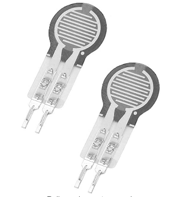
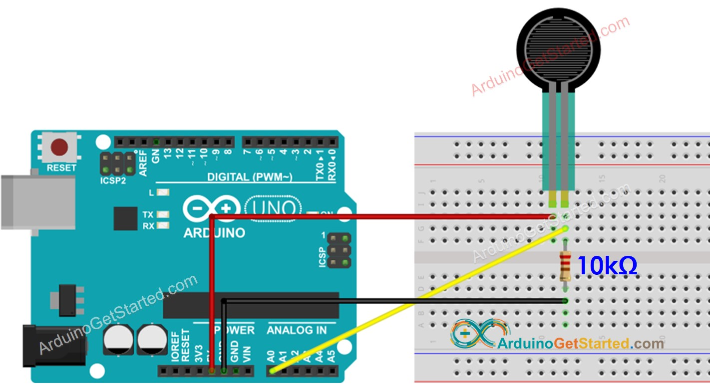

# Pressure sensor
This repo is about using Arduino to get te Thin Film Pressure Sensor data.
First, you need Arduino IDE/PIO to build the script and upload to the board. Then, using the pySerial to get the data. Finally, you could read and publish data under the ROS platform. This repo as a **ros-package**.

## Sensor Information



Sensor : Film Pressure Sensor [Link](https://www.amazon.com/Pressure-Precise-Force-Sensitive-Resistor-Resistance-type/dp/B07T1CHY58/ref=asc_df_B07T1CHY58/?tag=hyprod-20&linkCode=df0&hvadid=475788796522&hvpos=&hvnetw=g&hvrand=15301064731223659480&hvpone=&hvptwo=&hvqmt=&hvdev=c&hvdvcmdl=&hvlocint=&hvlocphy=1027116&hvtargid=pla-1002375752122&psc=1)

Model: RP-C10-ST

Specification :

- Trigger force: 20 g, triggered when resistance is less than 200 kΩ by default
- Pressure sensing range: 20 g ~ 2 kg
- Pressure action mode: Static or dynamic (frequency within 10 Hz)
- Non-trigger resistance: More than 10 MΩ
- Activation time: less than 0.01 S
- Operating temperature: -40 ℃ ~ +85 ℃
- Lag: +10%, (RF+ - RF-)/FR+, 1000g force
- Response time: < 10 ms

Circuit diageam



Source : [Link](https://arduinogetstarted.com/tutorials/arduino-force-sensor)

# Home come
1. Using Platformio to build and upload the script to the board
2. Read sensor data by pySerial
3. Publishing data under ROS

## Platformio
Board : UNO

Using vs code
```Ctrl``` + ```Atl``` + ```P```

1. Open Home page and select the project (Platformio : Home)
2. Build and Upload
3. Open Serial Monitor (Platformio : Serial Monitor)

## pySerial

requriement : 
- pySerial

### How to Run : 

```bash=
conda env create -n pressure_sensor -f environment.yml
conda activate pressure_sensor
python scripts/pressure_sensor_pyserial.py
```

## ROS
requriement : 
- ROS
- pySerial

### How to run :
```bash=
rosrun pressure_sensor pressure_sensor_ros.py
```